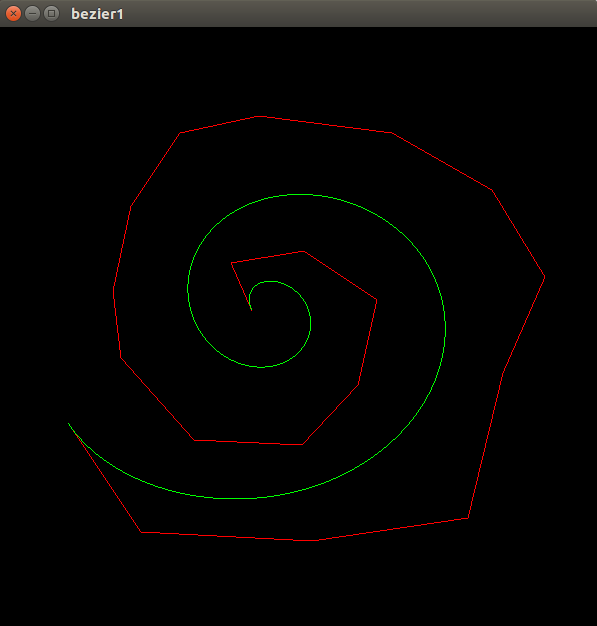
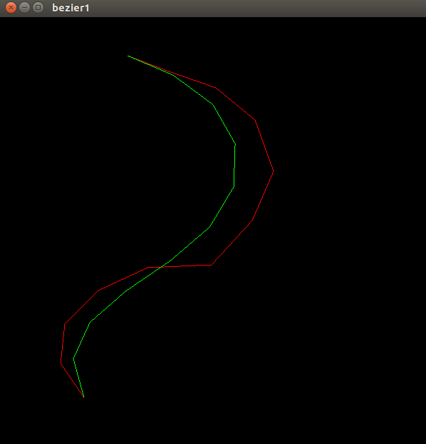
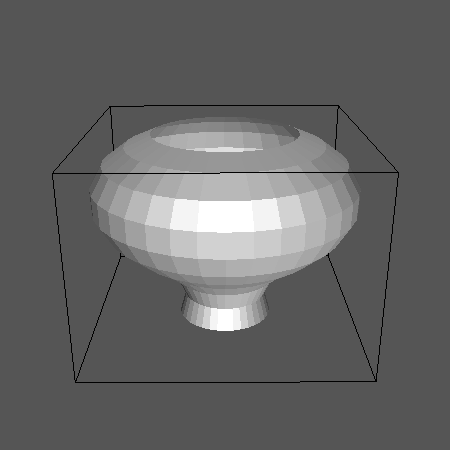
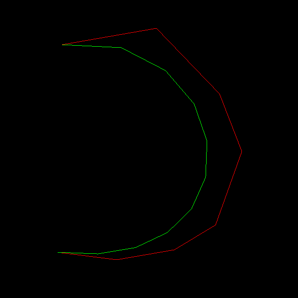
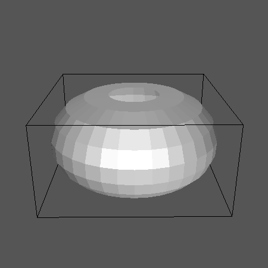
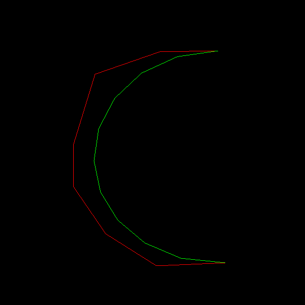
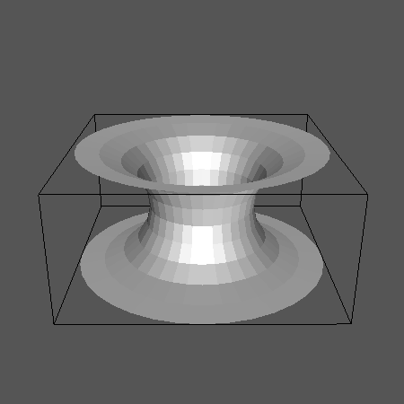

# Introduction
This repository contains an implementation of de Casteljau's algorithm for generating Bezier curves. I've used OpenGL and FreeGLUT to create a user interface for viewing and editing the curve. The code also generates a surface of revolution by rotating the curve around the Y-axis, and triangulates the surface to create a mesh. The mesh so created is stored in the .off format and can be visualized using any mesh viewer, such as Geomview, Meshview and Paraview.

# The User Interface
I've used FreeGLUT to create a window for creating, displaying and editing the curve. The user can add a control point by left-clicking on the desired point in the window. A control point can be moved by right-clicking on it and dragging it to the desired location. To delete a control point, the user can simply click on it with the middle mouse button. Following is a picture of the window:



# Discussion
## De Casteljau's Algorithm
In my implementation, the linear interpolations are performed layer-by-layer. Thus, the time complexity of the code for generating a point on a curve of degree n is T(n) = O(n2). Following is the peudo-code of my implementation:
```
Algorithm generatePoint(double t, int s_index, int e_index) //Generates a point using De Castlejau's algorithm

input: double parameter t, starting index of control points, ending index of control points

return: The point generated by De Casteljau's algorithm

	if(e_index==s_index)

		return controlPoints[s_index]

	std::vector <Vertex3f> vec

	for(int i=s_index; i<=e_index; i++)

		vec.push(this->controlPoints[i])
	
	for(int i=0, i<(e_index-s_index), i++)

		for(int j=0, j<vec.size()-1, j++)

			vec[j] = lerp(vec[j], vec[j+1], t)

		vec.erase(vec.begin()+(vec.size()-1))
	
	return vec[0]
```

## Editing the Curve
I've take advantage of the inherent optimal substructure of the recursive series of linear interpolations to efficiently re-generate the curve after adding a new control point. Thus, the time complexity of regenerating a point after adding a control point to a curve of degree n is T(n), instead of T(n+1). Following is the pseudo code of my method of handling the addition of a control point:
```
Algorithm addControlPoint(double x, double y, double z) //Adds a new control point and regenerates the curve

input: Coordinates of new control point

    this->controlPoints.push_back(Vertex3f(x,y,z))

    if(this->controlPoints.size()==1)

        for(double i=0; i<=1.0; i+=this->sample_rate)

            this->curvePoints.push_back(this->controlPoints[0])

        return;

    int j=0;

    for(double i=0; i<=1.0; i+=this->sample_rate, j++)

        this->curvePoints[j] = lerp(this->curvePoints[j], this->generatePoint(i, 1, this->controlPoints.size()-1), i)

```
However, while deleting or moving a point, the entire curve has to be regenerated and the time complexity remains T(n+1).

## Surface of Revolution
The surface of revolution is created by revolving each point on the curve around the Y-axis by increments of 10 degrees. The surface is the  triangulated layer by layer, splitting 4 neighbouring points into two groups such that their surfaces are non-overlapping. The total number of faces generated = (ceiling(1/sample_rate)-1) * ceiling(360/degree_of_rotation) * 2
```
Algorithm rotateCurve(double angle, BezierCurve* curve_ptr) //Rotates the 2D curve along the Y-axis and generates a mesh for tthe surface of revolution generates
input: Angle of rotation, Pointer to the 2D curve
return: Mesh containing the surface of revolution
    
    Mesh mesh = Mesh();
    
    vector< vector< Vertex3f > > mpoints; //Layer-wise points generated by rotating the curve
    
    for(auto cpoint: curve_ptr->curvePoints)
    
        auto points = rotatePoint(cpoint, angle)
    
        mpoints.push_back(points)
    
        for(Vertex3f point : points)
    
            mesh.addVertex(Vertex3f(point.getX(), point.getY(), point.getZ()))
    
   
    int no_vertices_ring = mpoints[0].size()
    
    mesh.setEdgeCount(no_vertices_ring*(curve_ptr->curvePoints.size()+2))
    
    for(int i=1; i<mpoints.size(); i++)
    
        int count = 0 //Number of faces
    
        for (int j=1; j<=no_vertices_ring; j++)
    
            vector <int> quad;
    
            int temp = j
    
            if(j==no_vertices_ring)
    
                temp = 0
   
            quad.push_back((i-1)*no_vertices_ring+(j-1))
    
            quad.push_back((i-1)*no_vertices_ring+temp)
    
            quad.push_back(i*no_vertices_ring+temp)
    
            quad.push_back(i*no_vertices_ring+(j-1))
    
            auto faces = triangulate(quad) //Triangulates a surface represented by four corner points
    
            mesh.addFace(faces[0])
   
            mesh.addFace(faces[1])
    
            count+=2
    
    return mesh

```

# Results
Here are a few of the curves as displayed in our user interface and their corresponding surfaces of revolution in Geomview:
  1. 
  2. 
  3. 

